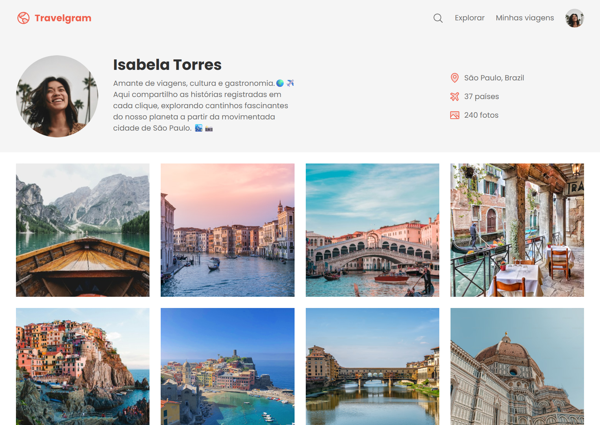

[PROJECT__BADGE]: https://img.shields.io/badge/📱Project_online_preview-000?style=for-the-badge&logo=project
[PROJECT__URL]: https://rafaelfidelisss.github.io/Travelgram-Page-FlexCSS/

<h1 align="center"> Travelgram </h1>

  <a href="#-tecnologias">Tecnologias</a>&nbsp;&nbsp;&nbsp;|&nbsp;&nbsp;&nbsp;
  <a href="#-projeto">Projeto</a>

 

  

## 💻 Projeto

Um layout do perfil de uma rede social de fotos de viagem, para praticar os coneitos de CSS Flexbox.

[![project][PROJECT__BADGE]][PROJECT__URL]

## 🚀 Tecnologias

Esse projeto foi desenvolvido com as seguintes tecnologias:

- HTML e CSS
